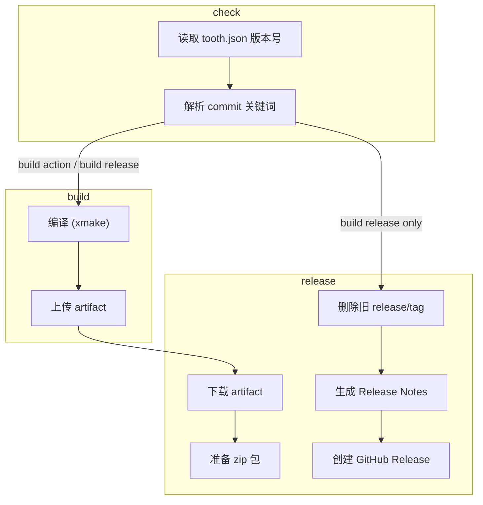

# GitHub Actions 工作流指南

本仓库使用 GitHub Actions 进行持续集成和发布。当代码推送到 `main`/`master` 分支时，工作流会根据 commit 信息中的关键词自动执行。

[](https://xmake.io)
[](https://en.cppreference.com/w/cpp/20)
[](https://learn.microsoft.com/en-us/cpp/)
[](https://github.com/VincentZyuApps/levilamina-plugin-serverinfo-rest/actions/workflows/build.yml)

## 📋 概述

CI/CD 流水线由 **commit 信息中的关键词** 驱动。推送到主分支时，只需在 commit message 中包含对应关键词，GitHub Actions 会自动完成后续工作。

## 🔑 关键词

| Commit 信息中的关键词 | 构建 | GitHub Release |
|----------------------|:---:|:---:|
| `build action` | ✅ | ❌ |
| `build release` | ✅ | ✅ |

### 使用示例

```bash
# 仅构建，不发版（用于测试）
git commit -m "build action. fix: correct typo in config"

# 构建 + 发版
git commit -m "build release. feat: add new API endpoint"
```

## 📦 流水线阶段

```
check ──→ build ──→ release
  │         │         │
  │         │         └─ 下载构建产物
  │         │            删除旧的 release/tag（幂等）
  │         │            生成 Release Notes
  │         │            创建 GitHub Release
  │         │
  │         └─ 编译 (xmake)
  │            上传构建产物 (artifact)
  │
  └─→ 读取 tooth.json 的版本号
      解析 commit 关键词
```



## 🏷️ 版本号管理

版本号的**唯一数据源**是 `tooth.json`：

```json
{
    "version": "1.0.0"
}
```

**发版流程：**

1. 修改 `tooth.json` 中的版本号
2. 提交并 push：
   ```bash
   git add tooth.json
   git commit -m "build release. feat: ..."
   git push
   ```

Release 标签格式为 `v{version}`（如 `v1.0.0`），与 `tooth.json` 的下载 URL 模板一致。

## 📁 Release 产物结构

发布的 zip 包结构：

```
serverinfo-rest/
├── serverinfo-rest.dll
├── manifest.json
└── ...
```

解压到服务端 `plugins/` 目录即可。

## 🖱️ 手动触发

可以从 GitHub 仓库的 Actions 页面手动触发工作流：

1. 进入 **Actions → Build & Release → Run workflow**
2. 可选填写：
   - **Version**：覆盖 `tooth.json` 的版本号
   - **Create GitHub Release**：勾选以创建 Release

```
           ┌─ 有输入版本 ──→ 使用输入的版本
workflow ──┤
dispatch   └─ 无输入版本 ──→ 使用 tooth.json 的版本
```

## 🏗️ 构建环境
| 包 | 版本 | 说明 |
|:---|:---|:---|
| [](https://xmake.io) | 2.9.x | 构建系统 |
| [](https://learn.microsoft.com/en-us/cpp/) | 2022 | C++ 编译器 |
| [](https://en.cppreference.com/w/cpp/20) | C++20 | 语言标准 |
| [](https://github.com/LiteLDev/LeviLamina) | 26.10.x | 模组加载器 SDK |
| [](https://github.com/LiteLDev/LeviBuildScript) | — | 构建脚本插件 |
| [](https://github.com/nlohmann/json) | — | JSON 序列化 |
| [](https://learn.microsoft.com/en-us/windows/win32/api/winsock2/) | — | 网络 API (Ws2_32) |
